# 2月份 收益：3200

### 第一周 收益：-500

| 日期  | 收益 | 手续费 | 利润 |
| ----- | ---- | ------ | ---- |
| 02-01 | 390  | 450    | -100 |
| 02-03 | 380  | 750    | -400 |

### 第二周 收益：3700

| 日期  | 收益  | 手续费 | 利润  |
| ----- | ----- | ------ | ----- |
| 02-06 | 6200  | 600    | 5600  |
| 02-07 | 1900  | 800    | 1100  |
| 02-08 | 1900  | 600    | 1300  |
| 02-09 | -3000 | 700    | -3700 |
| 02-10 | 900   | 1500   | -600  |

## 2月1日

收益：-100

### 夜盘

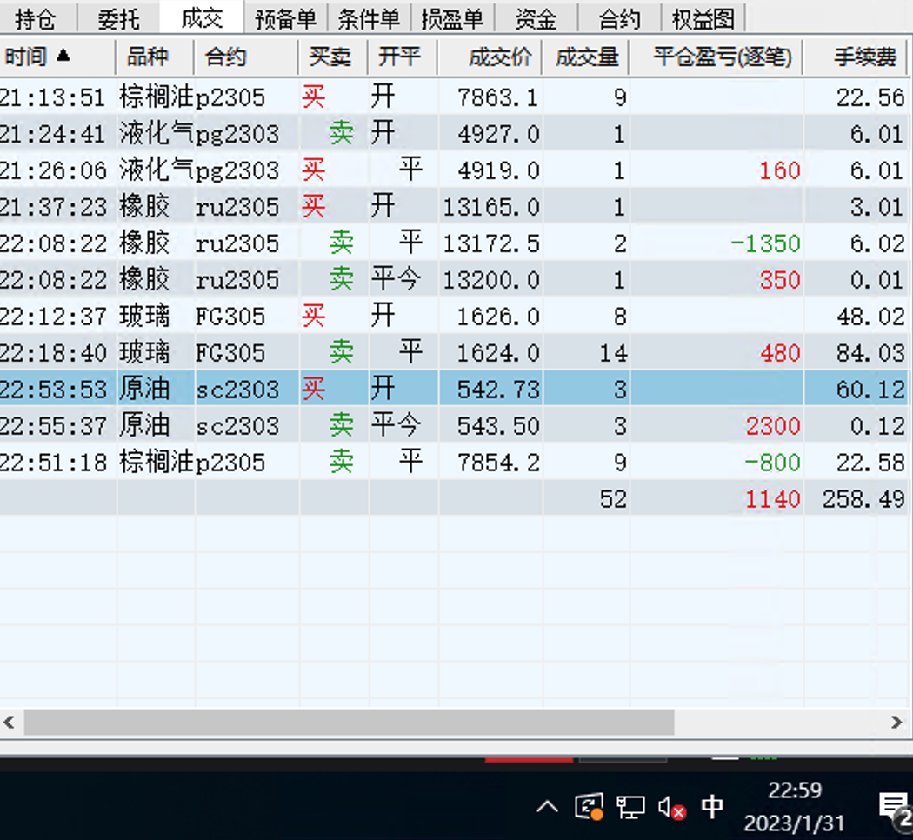

### 尾盘

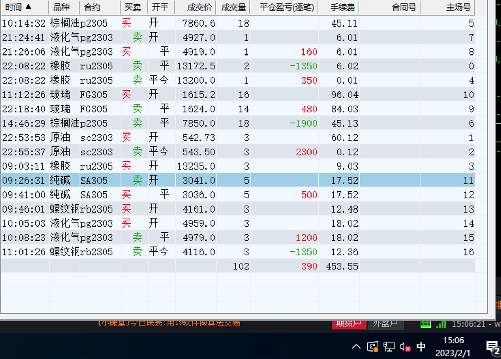

## 2月2日

无记录

## 2月3日

收益：-400

操作记录：

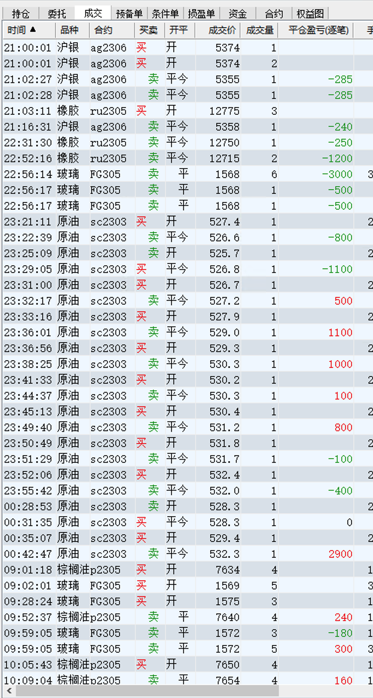

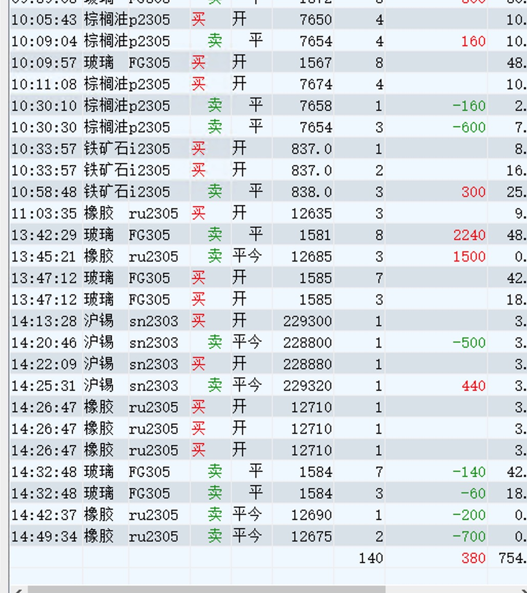

## 2月6日

收益：5600

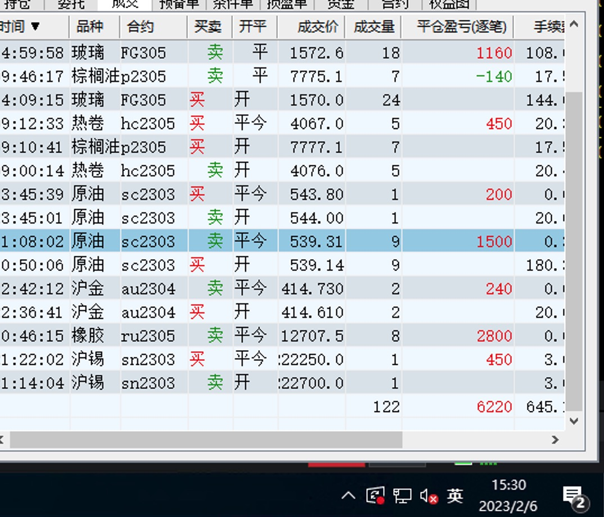

## 2月7号

收益： 1100

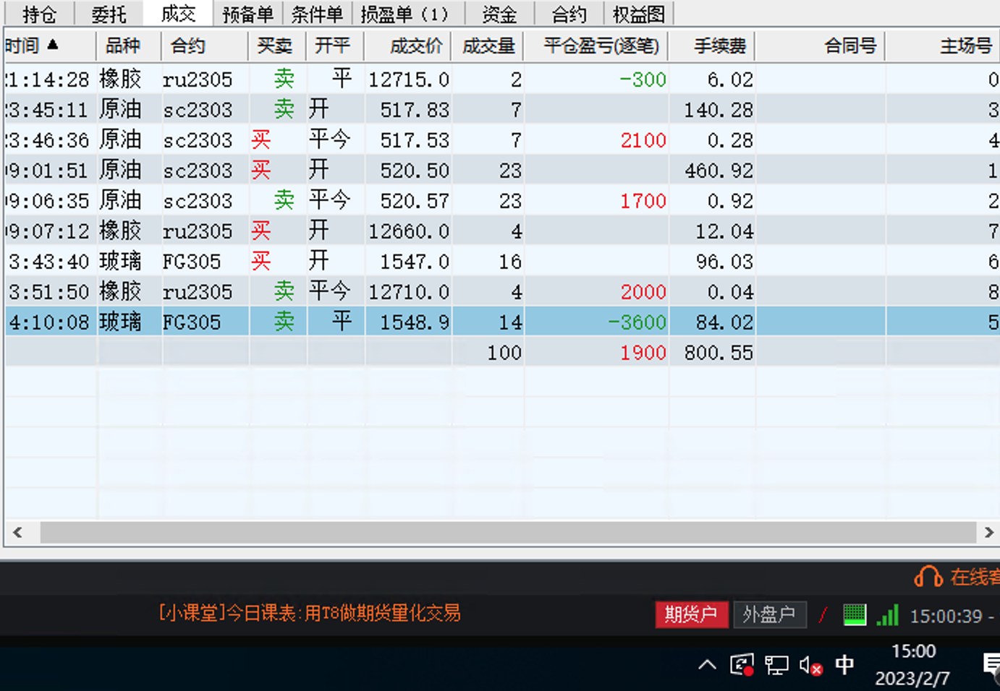

## 2月8日

收益： 1300

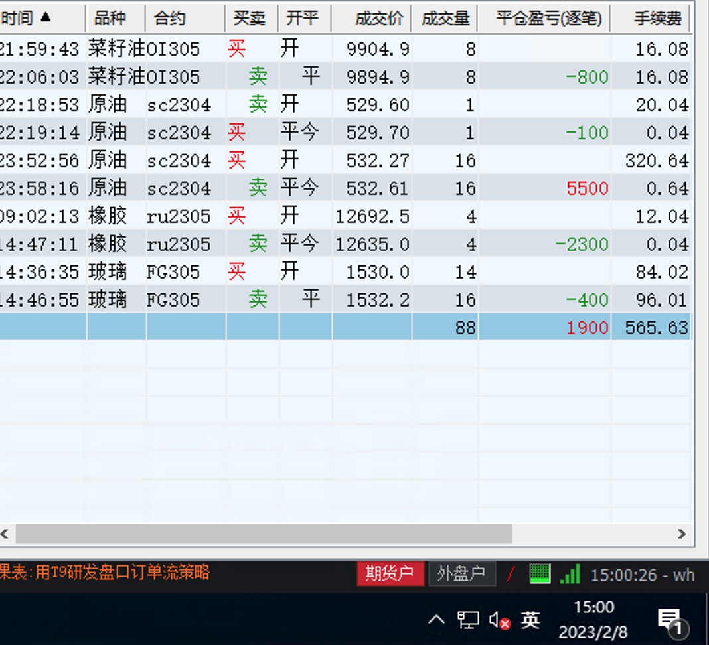

### 夜盘原油

## 2月9日

收益：-3800

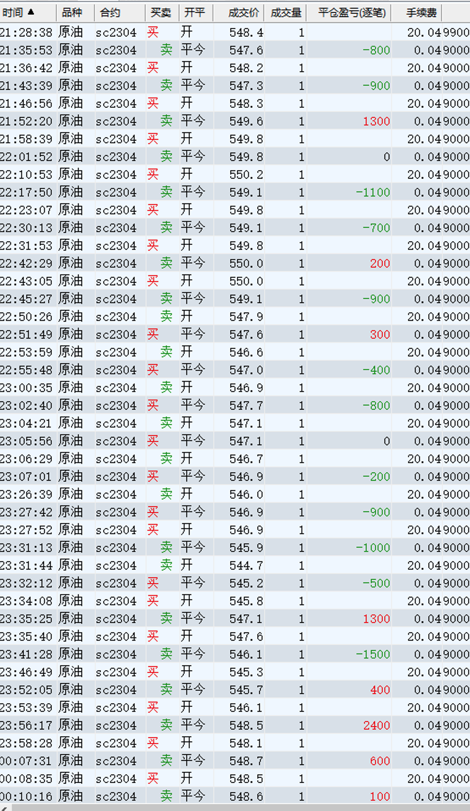

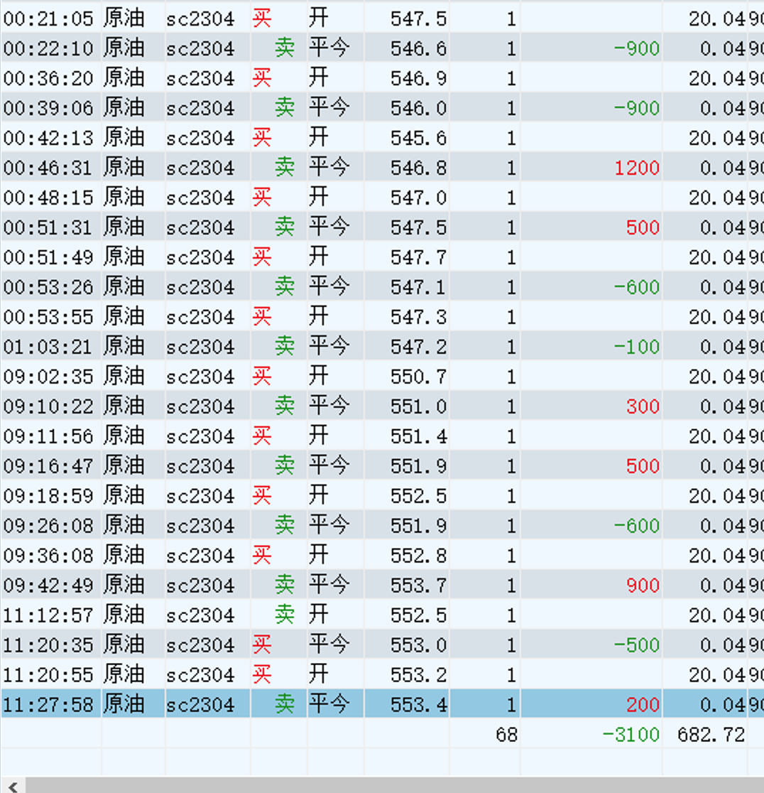

## 2月10日

收益：

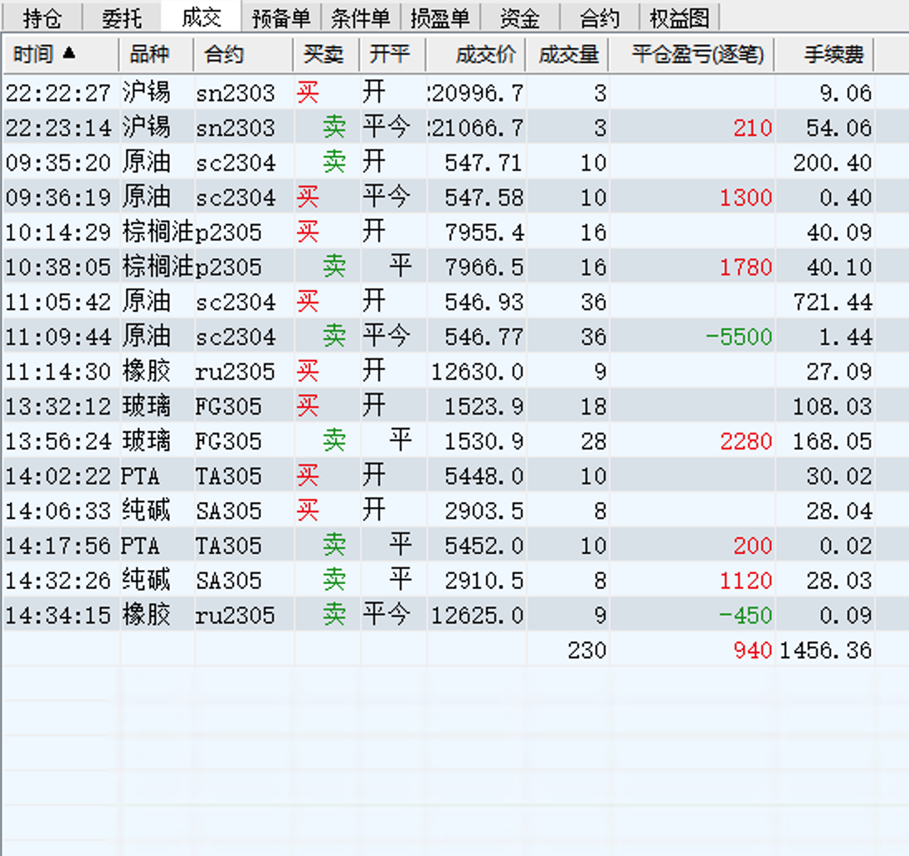

### 夜盘原油

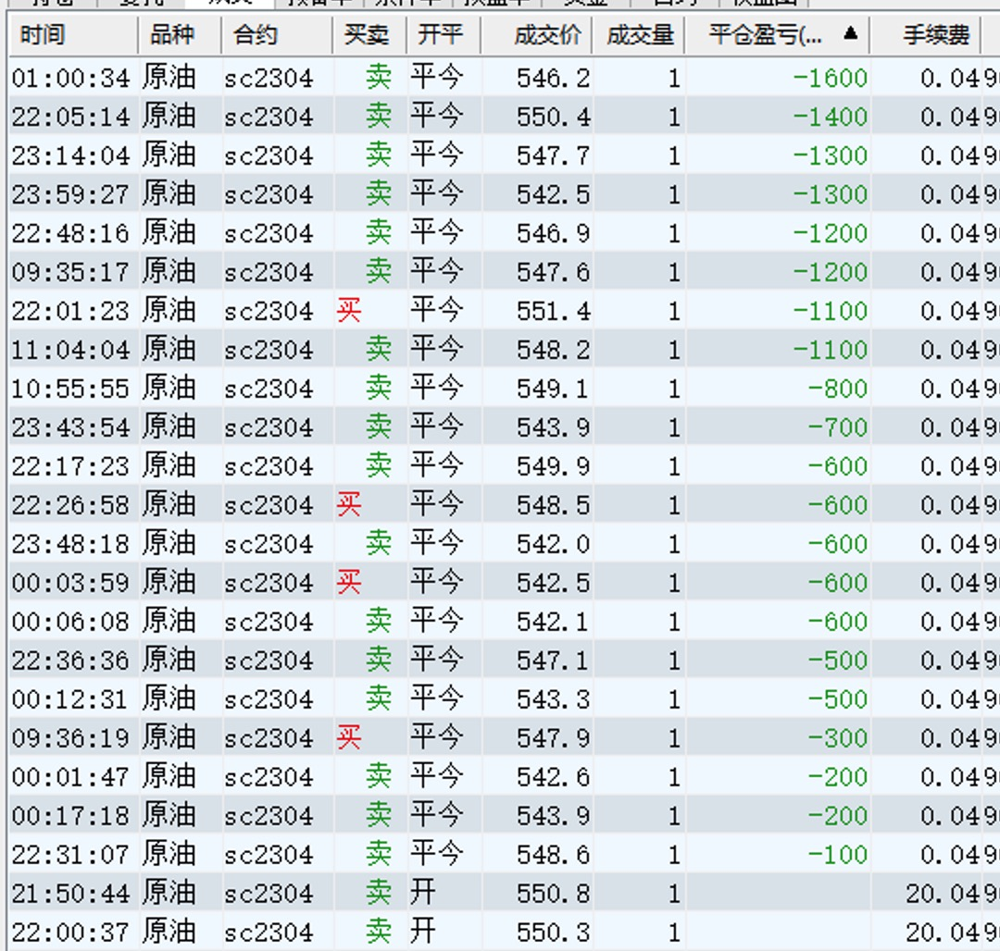
