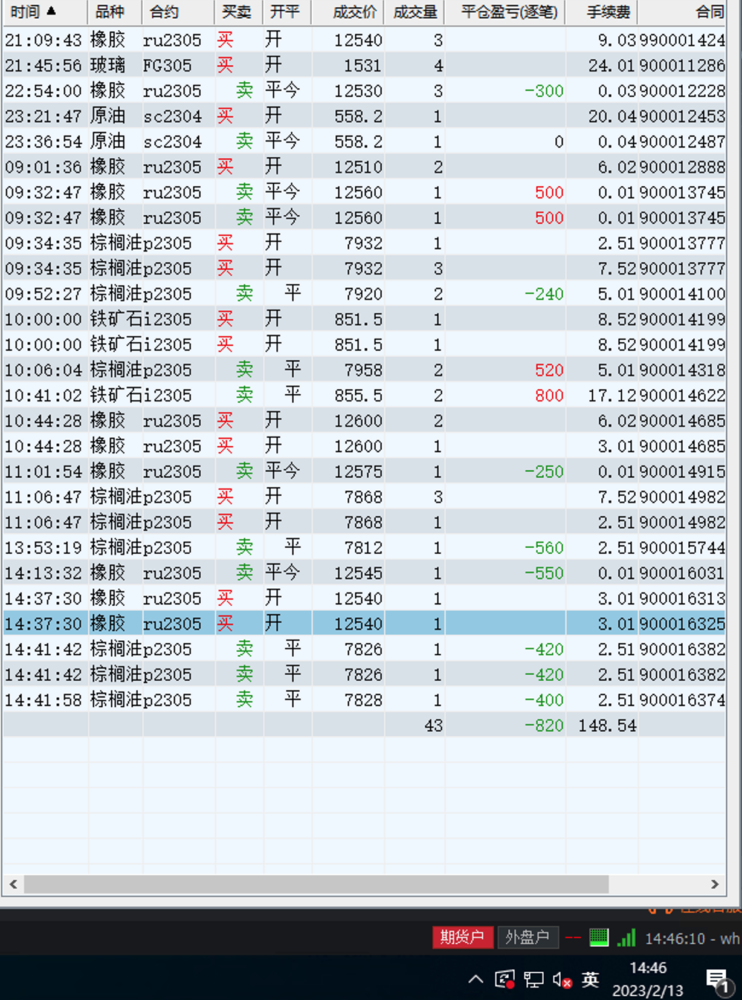
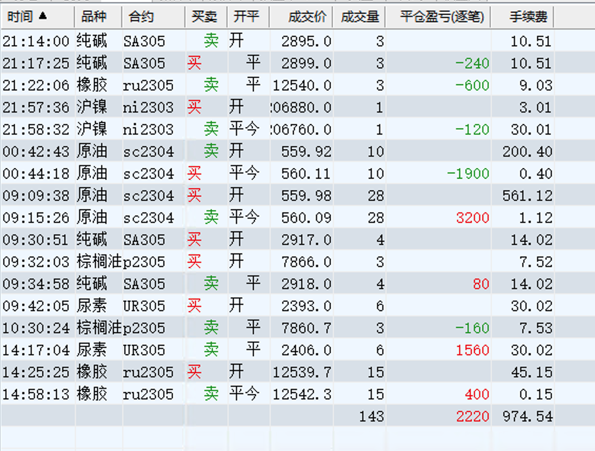
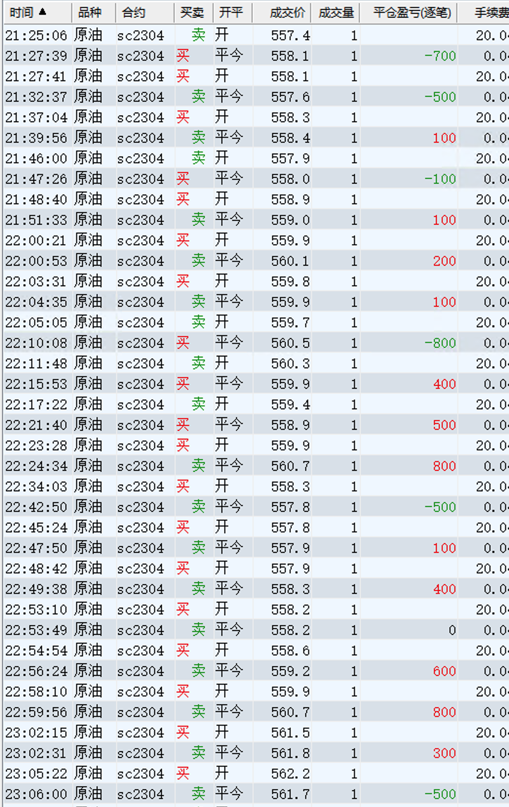
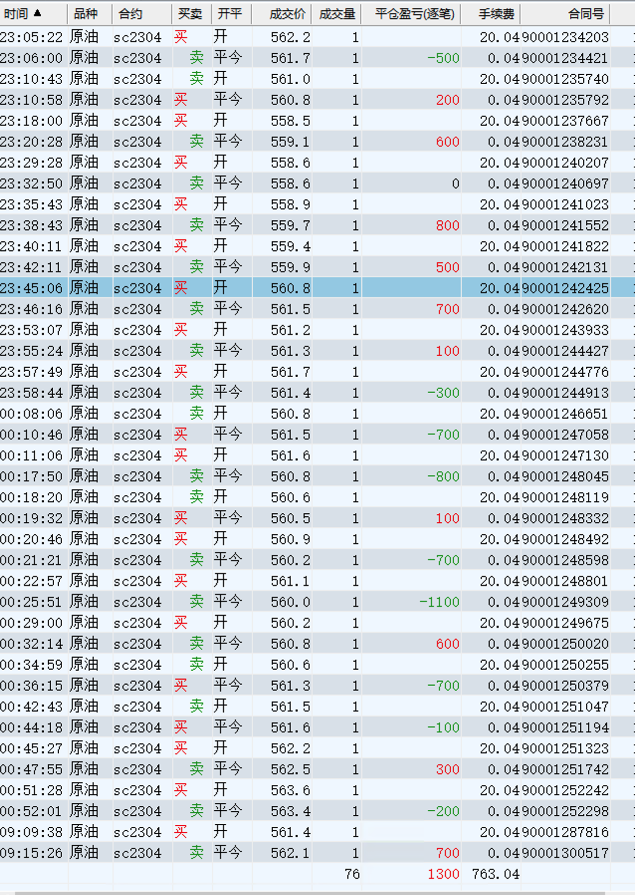
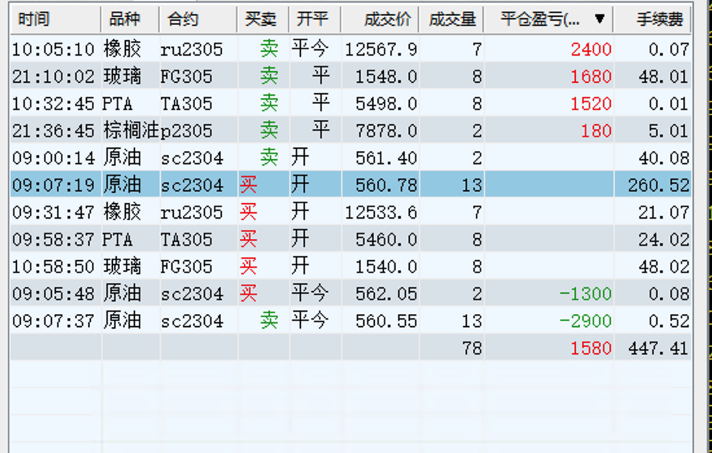
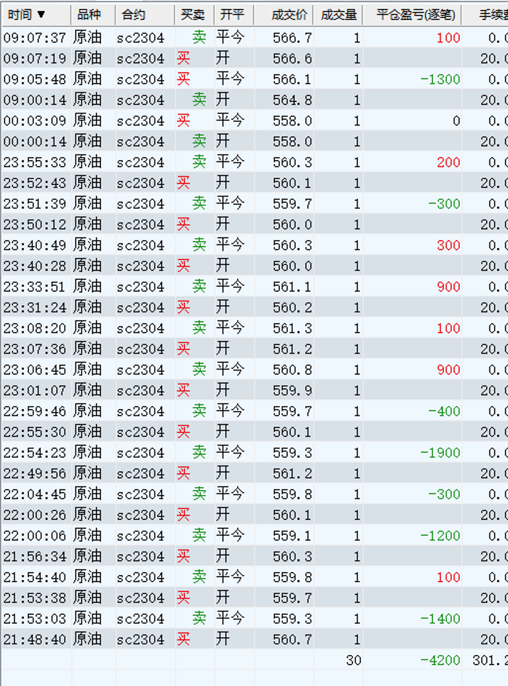

### 第三周收益：5700

| 日期  | 收益 | 手续费 | 利润  |
| ----- | ---- | ------ | ----- |
| 02-13 | -800 | 200    | -1000 |
| 02-14 | 2200 | 1000   | 1200  |
| 02-15 | 4900 | 300    | 4600  |
| 02-16 | 1500 | 400    | 1100  |
| 02-17 | 0    | 200    | -200  |

### 2月13日

收益：-1000

## 2月14日

收益：1200

* 降低收益预期，每天收入4000 即可
* 减少原油的操作

### 原油

## 2月15日

收益：4600

## 2月16日 （收益 1100）

* 下午不操作，不看盘
* 原油再尝试一下，考虑删除原油的操作

### 原油

## 2月17日 （收益-200）

* 2月份已经过了一大半，收益不理想，不如打工
* 以后不交易原油
* 收益不及预期，那就继续降低预期，每天收入2000 停止交易

