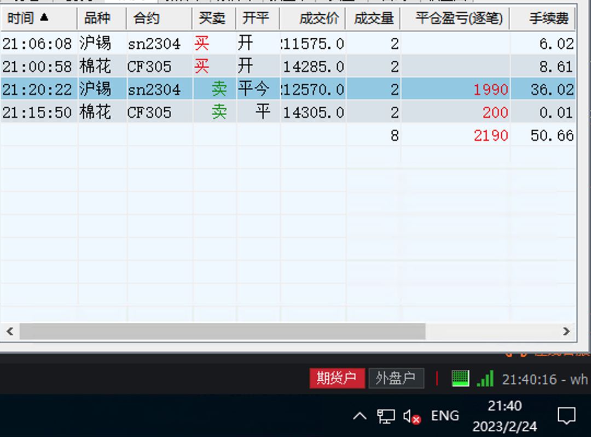

### 第五周收益：1900

| 日期  | 收益 | 手续费 | 利润 |
| ----- | ---- | ------ | ---- |
| 02-27 | 1700 | 100    | 1600 |
| 02-28 | 500  | 200    | 300  |

## 2月27日（收益：1600）

* 周一上午开盘，连续亏损橡胶和纯碱，停止交易

夜盘收益

## 2月28日（收益：300）

* 分析了一下一月底和2月底的交易，一到月底和月初会出现亏损。
* 最近考虑只做夜盘，白天不交易。

