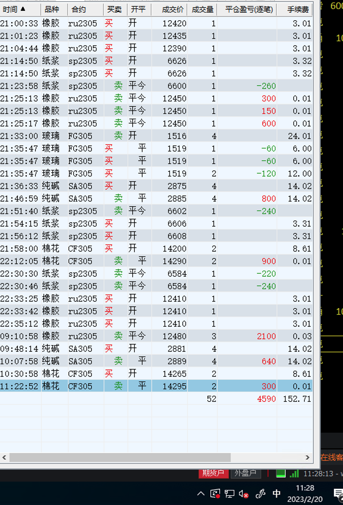
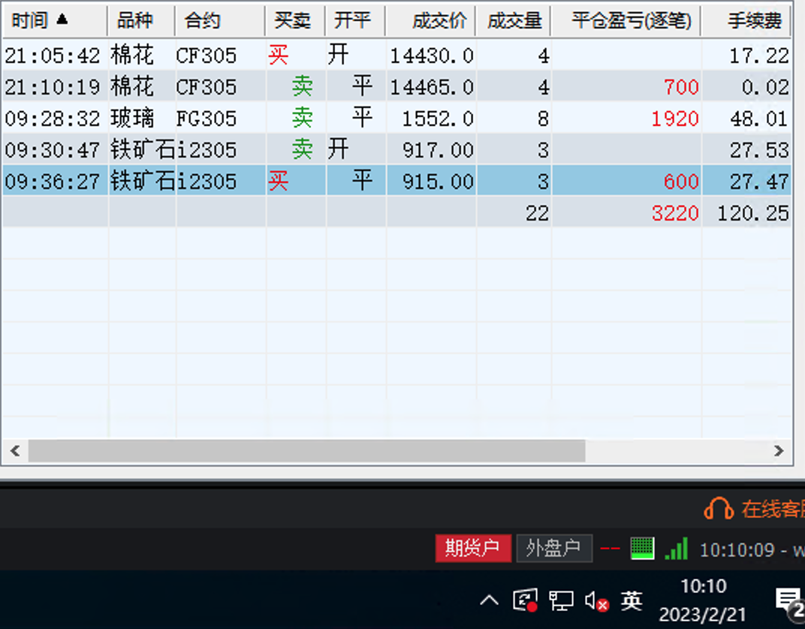
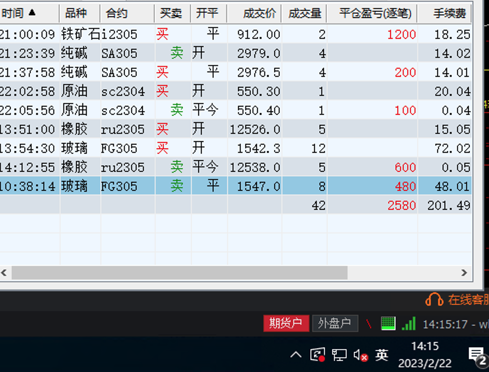
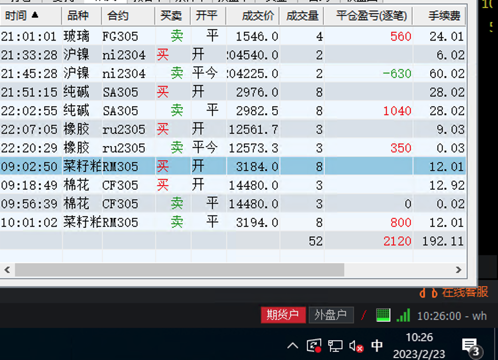

### 第四周收益：10300

| 日期  | 收益  | 手续费 | 利润  |
| ----- | ----- | ------ | ----- |
| 02-20 | 4600  | 200    | 4400  |
| 02-21 | 3200  | 100    | 3100  |
| 02-22 | 2600  | 200    | 2400  |
| 02-23 | 2100  | 200    | 1900  |
| 02-24 | -1200 | 300    | -1500 |

## 2月20日（收益：4400）

* 开仓次数少，利润到达预期
* 下午不看盘，不操作

## 2月21日（收益：3100）

* 任务提前完成，停止交易，不再看盘
* 开始学习算法

## 2月22日 （收益：2400）

* 全天无波动，找不到开仓的位置
* 提前结束交易

## 2月23日（收益：1900）

并不一定是利润到达预期就结束交易，有时候趋势开始的时候单子反而是比较好做的。突破只需要一两天时间，盘整需要2周，大部分的交易时间都是非趋势交易，所以不能在趋势开始的时候利润达到预期就停止交易。 提前结束交易的信号：

1. 震荡行情，多空趋势不明朗
2. 开仓频频亏损

* 今天不想操作了....

## 2月24日（收益：-1500）

* 连续亏损，说明与当前的盘面走势是相背的
* 必须停止交易，要不肯定会出现大额亏损
* 夜盘与周一谨慎操作或者不操作

