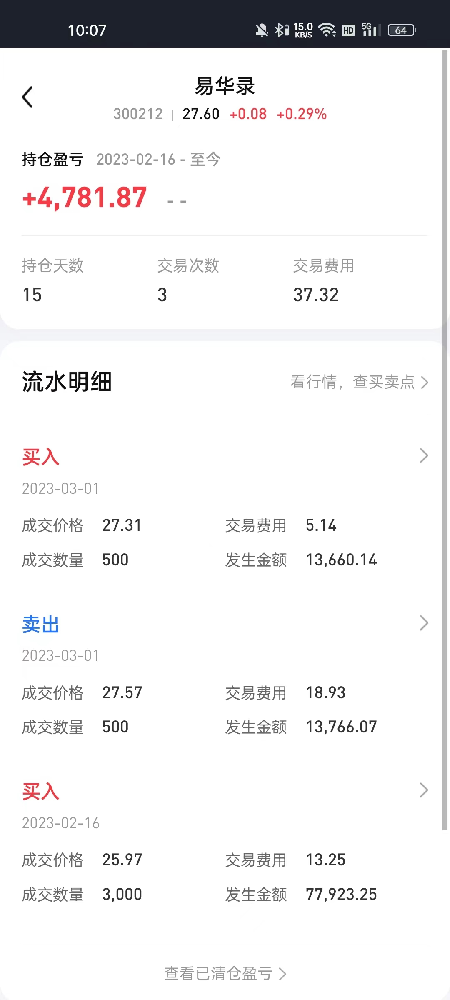
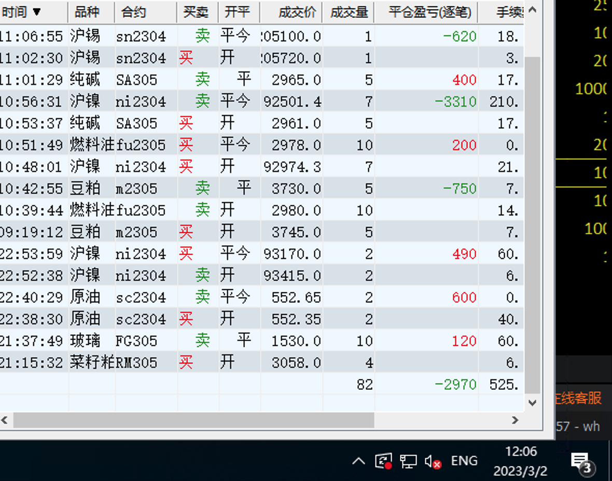
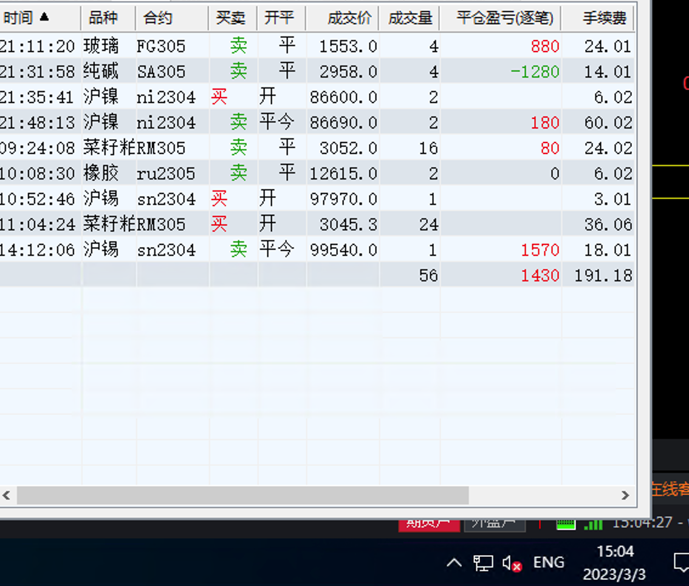

# 3月份（收益：2300）

| 日期          | 收益  | 手续费 | 利润  |
| ------------- | ----- | ------ | ----- |
| 03-01         | 300   | 500    | -200  |
| 03-02（股票） | 4800  | 0      | 4800  |
| 03-02（期货） | -3000 | 500    | -3500 |
| 03-03         | 1400  | 200    | 1200  |

## 3月1日

* 又是波动剧烈的一天

## 3月2日（收益：1300）

### 股票（4800）

* 今日股票卖出。收益太低，以后不做股票

### 期货（-3500）

* 亏损的最大原因在于又想屁吃了... 
* 继续保持之前的策略: 
  1. 2000 停止交易 
  2. 不看下午盘

## 3月3日（收益：1200）

