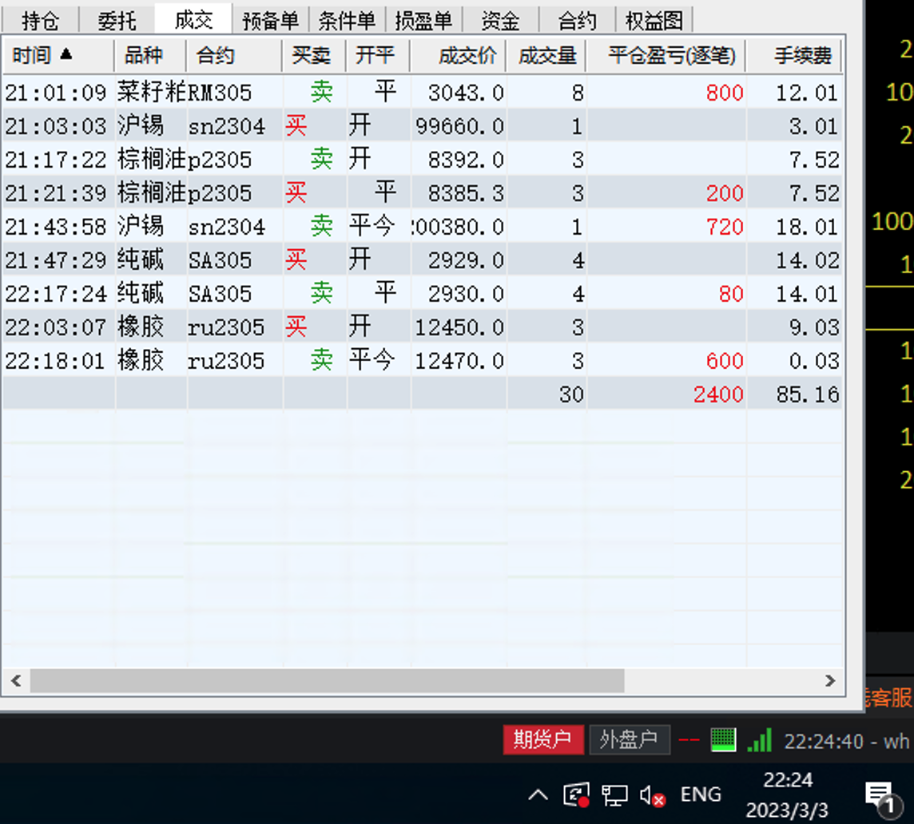

# 三月份第二周（收益：12500）

| 日期          | 收益   | 手续费 | 利润   |
| ------------- | ------ | ------ | ------ |
| 03-06         | 5200   | 300    | 4900   |
| 03-07         | 400    | 200    | 200    |
| 03-08         | 无操作 | 无操作 | 无操作 |
| 03-09         | 无操作 | 无操作 | 无操作 |
| 03-10（股票） | 7400   | 0      | 7400   |

## 3月6日（收益：4900）

### 3月3日夜盘

## 3月7日

## 3月8日 （无操作）

## 3月9日（无操作）

## 3月10日（收益7400）

